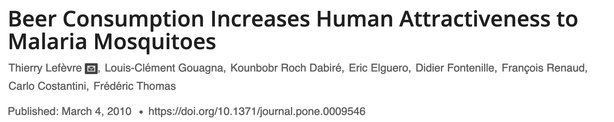
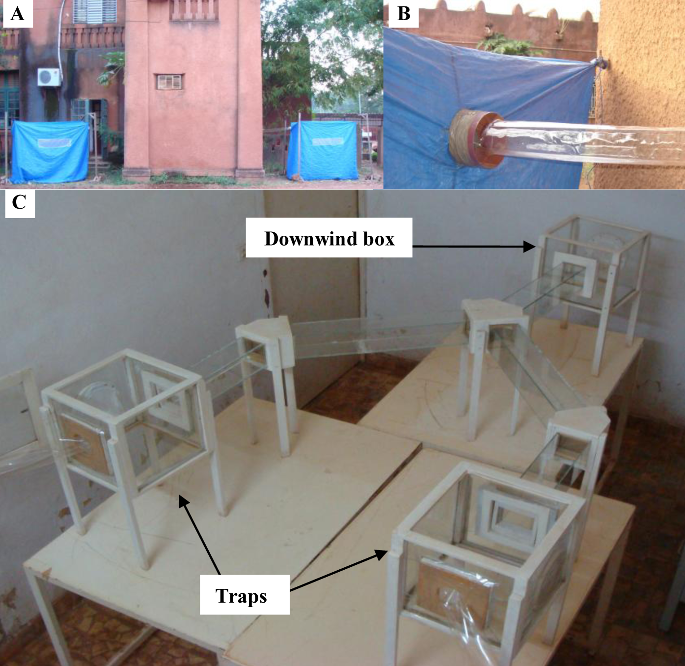
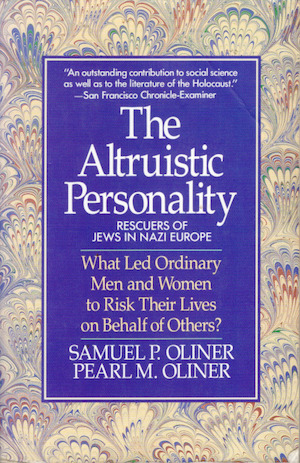

---
# YAML metadata
title: "Statistics without the agonizing pain"
author: Matthew Brett
linkcolor: RoyalBlue
urlcolor: RoyalBlue
<#ifndef HANDOUT>
suppress-bibliography: true
<#endif>
bibliography: data-science-bib/data_science.bib
---

# Without the pain

With thanks to John Rauser: [Statistics Without the Agonizing Pain](https://www.youtube.com/watch?v=5Dnw46eC-0o)

# Problem 1 - a biased jury?

* Around 1962: Robert Swain - a black man - sentenced to death
  by an all-white Jury in Talladega County, Alabama.
* Of the eligible jurors in the county, 26% were black.
* Swain appealed eventually to the [Supreme
  Court](https://en.wikipedia.org/wiki/Swain_v._Alabama) on the
  basis that the jury selection was biased.
* What do you think?

# Problem 1 - with a computer

<http://bit.ly/less-agony>

# Problem 2 - do mosquitoes like beer?

# The setup

# Problem 2

What do you think?

# Problem 2 - with a computer

<http://bit.ly/less-agony>

# Problem 3 - were rescuers democratic?

# The numbers

|           |Democratic|Other| Total |
|:----------|---------:|----:|------:|
| Bystander |         1|    6|     7 |
| Rescuer   |        32|    8|    40 |
| Total     |        33|   14|    47 |

Some percentages.

# Problem 3

What do you think?

# Problem 3 - with a computer

<http://bit.ly/less-agony>
